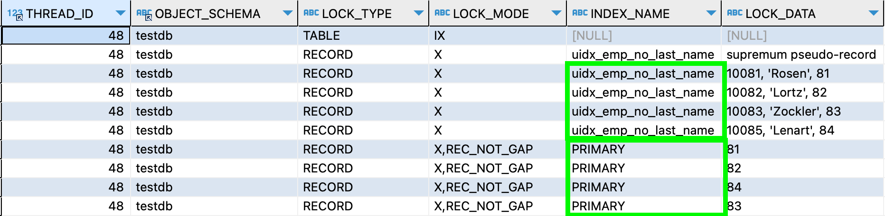
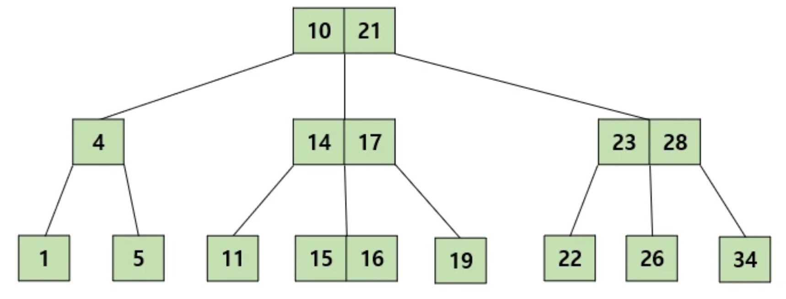
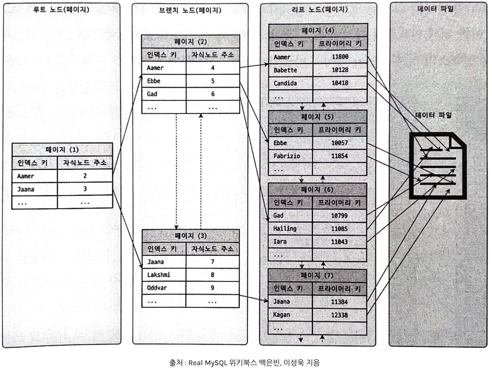

#### `InnoDB Index 구조`
~~~sql
CREATE TABLE `tb_user` (
  `id` int NOT NULL,
  `emp_no` int DEFAULT NULL,
  `first_name` varchar(10) COLLATE utf8mb4_general_ci DEFAULT NULL,
  `last_name` varchar(20) COLLATE utf8mb4_general_ci DEFAULT NULL,
  `hire_date` date DEFAULT NULL,
  PRIMARY KEY (`id`),
  KEY `idx_first_name` (`first_name`)
);
~~~
위의 테이블을 예시로 인덱스를 알아보자.  
먼저 인덱스를 하나 생성한다.
~~~sql
ALTER TABLE tb_user ADD UNIQUE INDEX uidx_emp_no_last_name(emp_no, last_name);
~~~

우리는 [Record Lock](https://github.com/outgrow0905/study-common/blob/main/src/main/java/com/example/common/database/A_InnoDB-Locking.md#record-locks)에 대해서 알아본 적이 있다.  
이때에 `update`에 사용된 `인덱스`와 `PK` 둘 다에 락이 걸렸던 것을 본 적이 있다.  
그대로 위의 인덱스를 가지고 다시한번 복습해보자.  

~~~sql
select * from tb_user where emp_no  >= 10081  for update;
~~~

쿼리에 사용된 `uidx_emp_no_last_name` 인덱스에 `X lock`이 걸리는 것은 이해가 된다.  
`PK`에는 왜 걸리는 것일까?   
이는 `InnoDB`의 인덱스 구조와 관련이 있다.  
이 말은 스토리지 엔진이 `InnoDB`가 아니면 위와 같이 `PK`에 락이 안잡힐수도 있다는 의미이기도 하다.  
그렇다면 `InnoDB`의 인덱스는 어떻게 생겼는지 알아보자.

- B Tree
  
- InnoDB 인덱스
  

첫번째 그림은 일반적인 `B Tree`의 구성이다.  
두번째 그림은 `InnoDB`의 인덱스 구조이다.  
`InnoDB`는 `B Tree`구조이다. 그런데 자세히 보면 첫번째 그림 구조와 두번째 그림구조는 차이가 있다.  

첫번째 그림과 두번째 그림을 비교하며 `InnoDB` 인덱스의 세 가지 특징들을 읽어보자.  

`B Tree` 사진에서는 `1`부터 `34`까지의 모든 데이터가 각 노드에 고르게 분포되어있다.  
`인덱스` 사진에서는 `리프노드`에 모든 데이터가 포함되어있다.  
`인덱스`의 `리프노드`에 전체 데이터가 있는것은 중요한 특징중 하나이다.    

`인덱스` 사진에서 `리프노드`들 간에 `작은 화살표`가 있는 것이 보일 것이다.  
이는 `인덱스`의 `리프노드`들이 서로 연결되어있는 `LinkedList`의 형식이라는 것을 의미한다.  
예를 들어 `페이지(4)`의 리프노드에서 `페이지(5)`로 조회해야한다면 페이지를 옮겨갈때마다   
다시 루트노드부터 시작해야할 필요 없이 다음 페이지의 주소를 알고 있고 바로 옮겨갈 수 있다는 것이다.  

마지막으로 리프노드에서 `프라이머리 키`부분을 살펴보자.  
이 부분이 `InnoDB 인덱스`의 특징 중 하나이다.  
모든 데이터를 가지고 있는 리프노드에서 다시 `PK`를 참조하고 있는 것이다.  
이러한 특징으로 `보조 인덱스`를 이용한 쿼리는 결국에 `PK`를 조회하게 되는 것이다.  

이제 맨 처음 질문에서의 `보조 인덱스`로 조회 시에 `보조 인덱스`와 `PK` 전부에 `X lock`이 걸린 이유를 알게 되었다.

#### 클러스터링 인덱스
`innoDB`를 사용하는 `mysql`의 `pk`는 클러스터링 인덱스라고도 한다.  
클러스터링 인덱스는 어떤 특성을 가지고 있을까?    

`클러스터링`은 데이터가 물리적으로 모여있는 것을 의미한다.  
실제로 클러스터링 인덱스 즉 `pk`의 데이터들은 물리적으로 `순서대로` 그리고 `가깝게` 위치하고 있다.  
이러한 특성은 장단점이 있다.

innoDB가 아닌 다른 스토리지 엔진에서 한번 저장된 데이터의 위치는 절대로 변하지 않는다.  
하지만 클러스터링 인덱스의 데이터는 순서대로, 가깝게 위치해야 하는 특성으로 인해 `pk`의 변경이 일어난다면 실제 저장위치가 순서에 맞는 올바른 자리를 찾아 넣어야한다.    
데이터의 변경요청에도 굳이 순서대로 물리적으로 가깝게 변경하지 않는 다른 스토리지엔진과 비교하여 데이터 수정이 느릴 것이 분명하기에 단점은 금방 하나를 찾았다.    

~~~sql
UPDATE tb_user SET id = 2 WHERE id = 1
~~~

예를 들어 위의 `tb_user` 테이블에서 위의 쿼리가 수행된다면   
단순 데이터 수정이 일어나는 것이 아니라 올바른 저장위치를 찾은 뒤에 기존의 데이터를 지우고 또 다시 넣는 작업이 일어나게 된다.  
단순히 생각해도 단순 데이터 변경치고는 해야할 작업이 많아보인다.

장점을 찾기전에 이러한 이유로 위의 `InnoDB Index 구조`에서 모든 세컨더리 인덱스가 실제 데이터의 주소가 아닌 pk를 참조하는 특성이 생기게 된다.  
`innoDB`는 실제 데이터를 변경하여 물리적 주소까지 변경이 되는데, 모든 인덱스에서 실제 데이터 주소를 참조한다면 엄청난 부담일 것이다.  
따라서 이러한 특성으로 모든 세컨더리 인덱스는 pk를 참조하는 구조로 설계된 것이다.   

장점을 찾자면 `pk`가 순서대로 밀집되어 저장되기 때문에 pk의 범위검색이 빠르다.  
예를 들어, 위 테이블의 `id`를 `100부터 200까지` 조회한다고 가정해보자.  
하나의 페이지에 `50`개의 데이터가 저장된다고 가정헀을떄에 `innoDB`는 `2~3`개만 조회하면 된다.  
하지만 다른 스토리지엔진이라면 모든 데이터가 최악으로 분산되어있을 경우 `100`개의 페이지를 읽어와야 할 것이다.  

결론적으로는 쓰기성능을 포기하고 읽기성능을 높인 선택이라고 볼 수 있다.

#### 클러스터링 인덱스 사용 시 주의사항
모든 `세컨더리 인덱스`는 실제 데이터의 주소가 아닌 `pk`를 참조하고 있다.  
이는 `pk`값이 예를 들어 여러 컬럼으로 구성된 무거운 구성이라면 모든 `세컨더리 인덱스`에서 이 무거운 값을 참조해야 한다는 의미이다.  
이렇게 되면 세컨더리 인덱스의 추가작업이 `pk`가 무겁다는 이유로 버거운 작업이 될 수 있다.  

어쩔수없이 `pk`에 여러 컬럼을 복합해서 구성해야 하고, `세컨더리 인덱스`도 많이 필요한 테이블이 있을 수 있다.  
이런 경우에는 `AUTO_INCREMENT` 칼럼을 추가하고 이를 `pk`로 사용하는 것을 권장한다.  
이러한 인위적으로 추가한 `pk`는 세컨더리 인덱스 추가에 부담을 주지 않게된다.  
그리고 특히나 `INSERT` 작업이 많은 테이블이었다면 성능향상에 도움이 된다.  
단순 `AUTO_INCREMENT는` 알아서 순차적으로 데이터를 집어넣기만 하면 되지만, 여러 컬럼의 복합이라면 `INSERT`마다 위치를 찾아야 하기 때문이다.