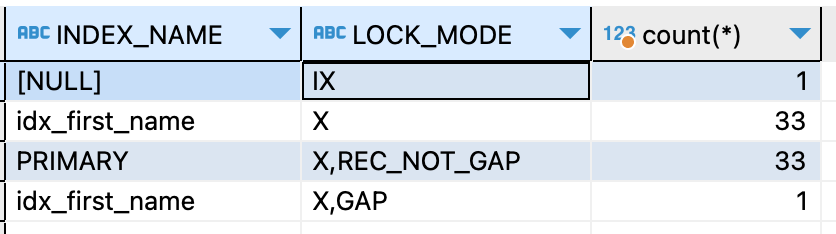
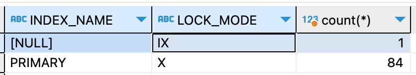
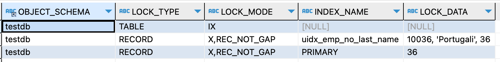
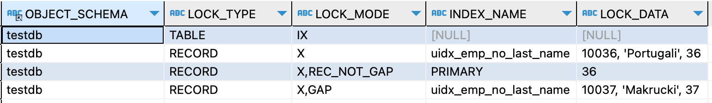

#### Intention Locks
`intention lock`은 테이블에 설정하는 락이다.  
`intention shared lock(IS)`, `intention exclusive lock(IX)` 두 종류가 있다.    
테이블에 설정함과 동시에 하위 레벨인 `row` 단위에도 락을 설정하게 된다.    

`IS lock`는 `row`에 `S lock`을 설정하게 된다.  
예를 들어 `SELECT ... FOR SHARE` 구문은 `테이블`에는 `IS lock`을 설정하고 설정범위가 되는 `row`에는 `S lock`을 설정한다.

`IX lock`은 `row`에 `X lock`을 설정하게 된다.  
예를 들어 `SELECT ... FOR UPDATE` 구문은 `테이블`에는 `IX lock`을 설정하고 설정범위가 되는 `row`에는 `X lock`을 설정한다.   
(`UPDATE, INSERT, DELETE`도 당연히 같다.)

호환되는 표는 아래와 같다.

 |    | X    | IX    | S     | IS|
|-----|-------|-------|---|---|
| X   |Conflict| Conflict | Conflict  |Conflict  |
| IX  |Conflict| Compatible | Conflict  |Compatible  |
| S   |Conflict| Conflict | Compatible | Compatible |
| IS  |Conflict| Compatible | Compatible | Compatible |

위의 표에서 `X, IS, S, IS` 컬럼들은 모두 `테이블`에 걸리는 락이라고 이해하고 시작하자.  
또한 `Conflict`라고 해서 트렌젝션이 실패하는 것을 의미하는 것은 아니다. 일단 대기하게 되는 상태라고 생각해야 한다.  
`Compatible`이라면 `테이블`단위 `lock` 획득 과정은 통과한다고 이해해야 한다. `테이블` 단위 `lock` 획득 과정을 통과해도 `row` 단위 `lock`을 획득하는 과정에서 대기하게 될 수 있다.

하나씩 설명해보겠다.  

`t1`에 `IX lock`이 걸린 상황부터 보자.  
일단 특정 `테이블`에 `IX lock`을 하는 방법은 많지만 특정 `row`에 `update`문을 수행했다고 가정해보자.

`t1.IX - t2.X`: `t1`에서 특정 `테이블`의 특정 `row`에 `X lock`을 설정하는 작업이 수행중인데, 같은 `테이블`에 `X lock`을 수행할 수는 없을 것이다.  
`t1.IX - t2.IX`: `t1`에서 특정 `테이블`의 특정 `row`에 `X lock`을 설정하는 작업이 수행중인데, 같은 `row`가 아니라면 `테이블` 단위 `lock` 경합부터 굳이 막을 필요는 없을 것이다. 
혹시 같은 `row`를 수정하려고 한다면 해당 `row`에 `X lock`을 획득할 때까지 `t2`는 대기해야 한다.  
`t1.IX - t2.S`: `t1`에서 특정 `테이블`의 특정 `row`에 `X lock`을 설정하는 작업이 수행중인데, 해당 테이블에 `S lock` (ex. `read only`)를 설정할 수는 없을 것이다.  
`t1.IX - t2.IS`: `t1`에서 특정 `테이블`의 특정 `row`에 `X lock`을 설정하는 작업이 수행중인데, 같은 `row`가 아니라면 `테이블` 단위 `lock` 경합부터 굳이 막을 필요는 없을 것이다. 
혹시 같은 `row`에 `S lock`을 설정하려고 한다면 `S lock`획득까지 기다리면 된다.  

`t1`에 `IS lock`이 걸린 상황을 보자.  
`t1.IS - t2.X`: 특정 `row`에 `S lock`이 걸려있는 상황일 텐데 해당 `테이블`에 `X lock`을 걸수는 없다.    
`t1.IS - t2.IX`: 같은 `row`만 아니라면 막을 필요는 없다. 같은 `row`라면 `t2`가 대기하게 된다.  
`t1.IS - t2.S`: 특정 `row`에 `S lock`을 설정하고 있는데 `테이블` 전체에 `S lock`을 설정하려고 한다니 굳이 막을 필요는 없다.  
`t1.IS - t1.IS`: `S lock`끼리는 호환이 되니 같은 데이터든 아니든 막을 필요가 없다.  

#### Record Locks
`record lock`은 인덱스에 설정하는 `lock`이다.   
`SELECT c1 FROM t WHERE c1 = 10 FOR UPDATE;` 쿼리를 예로 들면 `c1 = 10`에 해당하는 `row`에 `record lock`이 설정된다.  
인덱스에 설정한다고 했는데 인덱스가 없는 테이블이면 어떨까?  
개발자가 직접 생성한 인덱스가 없다 하더라도 `InnoDB`는 `clustered index`를 테이블마다 가지고 있다. `primary key`라고 보아도 무방하다.   
그러한 테이블이라면 `record lock`은 `(hidden) clustered index`에 설정된다.

인덱스를 잡그는 것의 의미를 테스트를 통해 알아보자.  
그리고 인덱스가 여러개 있는 테이블이면 어떻게 잠그는지도 확인해보자.  
아래의 테이블 정보로 진행하겠다.  

~~~sql
CREATE TABLE `tb_user` (
  `id` int NOT NULL,
  `emp_no` int DEFAULT NULL,
  `first_name` varchar(10) COLLATE utf8mb4_general_ci DEFAULT NULL,
  `last_name` varchar(20) COLLATE utf8mb4_general_ci DEFAULT NULL,
  `hire_date` date DEFAULT NULL,
  PRIMARY KEY (`id`),
  KEY `idx_first_name` (`first_name`)
);
~~~

테스트 대상 데이터 조건은 아래와 같다.

~~~sql
select * from tb_user where first_name = 'Mary' and last_name = 'Peha'; -- count = 1
select * from tb_user where first_name = 'Mary'; -- count = 33
~~~

트렌젝션을 켜고 아래의 쿼리를 수행한 뒤 락 상태를 확인해보자.

~~~sql
-- update
update tb_user force index(idx_first_name) set hire_date = DATE_FORMAT(now(), '%Y-%m-%d') where first_name = 'Mary' and last_name = 'Peha';
-- check
select INDEX_NAME, LOCK_MODE, count(*) from performance_schema.data_locks group by INDEX_NAME, LOCK_MODE;
~~~

`idx_first_name` 인덱스과 `PRIMARY` 인덱스 둘 다 `33`개씩 락이 걸려있는 것을 확인했다.  
당연히 위의 락이 잡힌 상태에서 다른 쓰레드에서 `first_name`이 `Mary`인 데이터를 `key`로 `update`를 시도해면 대기하게 된다. 

~~~sql
update tb_user set hire_date = DATE_FORMAT(now(), '%Y-%m-%d') where id = 7; -- 대기
~~~

인덱스가 여러개인 경우 사용되는 모든 인덱스에 락을 건다.  
이것의 의미는 인덱스를 적절히 설정하지 않거나 `update` 문에서 `where` 조건을 적절하게 설정하지 않으면 개발자가 예상하는것보다 더 많은 데이터에 락을 걸 수 있음을 의미한다.  

위의 예시에서 인덱스도 있었고 `1`개의 레코드에만 락이 걸리기를 원헀는데 `33`개의 데이터에 락이 걸린것이 억울한가?  
만약 `idx_first_name` 인덱스조차 없었다면 위의 쿼리는 전체 데이터에 락을 걸게 된다.  
아래는 실제 결과이다.

#### Gap Locks / Next-Key Locks
`gap lock`은 말 그대로 간격을 잠그는 것이다.  
인덱스에서 특정 범위를 잠그면서 해당 범위에 새로운 데이터가 `insert` 되는것을 막는다.  

예제로 살펴보자.  
먼저 아래의 인덱스를 추가하자.

~~~sql
alter table tb_user add unique index uidx_emp_no_last_name(emp_no, last_name);
~~~

그리고 아래의 `update`를 수행해보자.

~~~sql
update tb_test
   set hire_date=DATE_FORMAT(now(), '%Y-%m-%d')
 where emp_no=10036 
   and last_name='Portugali'
;
~~~

조건에 부합하는 두개의 인덱스에 `X lock`이 걸리게 된다.  
(`gap lock`이 발생하지 않았다.)

인덱스의 두 컬럼조건 중 하나의 조건만으로 `update` 문을 수행해보자.

~~~sql
update tb_test
   set hire_date=DATE_FORMAT(now(), '%Y-%m-%d')
 where emp_no=10036 
;
~~~

조건에 해당하는 `id = 36`보다 바로 위, 그리고 바로 아래의 범위까지 `insert`를 막게 된다.  
예를 들어 `id = 36`의 바로 아래가 `id = 30`이고 바로 위가 `id = 39`라면 `31 ~ 38`까지의 범위가 `insert` 되는것을 막게 된다.

#### References
- https://dev.mysql.com/doc/refman/8.0/en/innodb-locking.html
- https://www.geeksforgeeks.org/multiple-granularity-locking-in-dbms/
- https://severalnines.com/blog/understanding-lock-granularity-mysql/
- https://copyprogramming.com/howto/multiple-granularity-locking-in-dbms
- https://bako94.tistory.com/157
- https://medium.com/daangn/mysql-gap-lock-%EB%8B%A4%EC%8B%9C%EB%B3%B4%EA%B8%B0-7f47ea3f68bc
- https://hoing.io/archives/4713