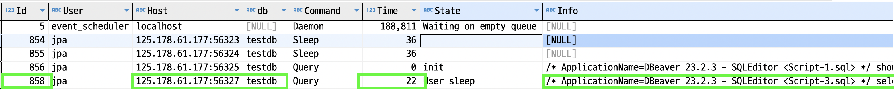

#### SHOW PROCESSLIST
관리하는 데이터베이스가 커지면 커질수록 느린 쿼리도 자주 발견되곤 한다.  
기존에 빠르게 수행되던 쿼리가 갑자기 느리게 작동할 수도 있고,  
충분한 테스트 없이 배포된 쿼리가 느리게 작동하여 모든 커넥션을 소모할 수도 있다.  

갑자기 서비스가 느려지고 여기저기서 문의가 들어오기 시작할 때, 
어떤 쿼리가 느리게 작동하는지 확인하는 것은 쉽지 않다.  

이럴 때 사용할 수 있는 유용한 모니터링 방법을 소개한다.  

~~~sql
SHOW PROCESSLIST;
~~~

이 쿼리의 결과값은 `어떤 호스트`에서 `어떤 데이터베이스`에 `어떤 쿼리`를 수행했으며,  
`현재 수행시간`이 어느정도로 소요되고 있는지 실시간으로 확인할 수 있는 명령어이다.  
그리고 각 쿼리별로 고유한 `id`도 있으며 이를 강제종료할 수도 있다.

만약 `id=858`의 쿼리가 문제가 된다면 아래의 `kill` 명령어로 강제종료하면 된다.

~~~sql
kill 858;
~~~