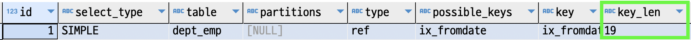

#### 인덱스 확장
mysql에서 `세컨더리 인덱스`는 `pk`값을 참조하고 있다고 하였다.  
mysql은 이 특징을 이용하여 마치 `세컨더리 인덱스 + pk`의 조합으로 마치 인덱스가 있는 것처럼 최적화를 수행한다.  

예를 들어 `dept_emp` 테이블의 `pk`는 `dept_no, emp_no` 이고, `세컨더리 인덱스`로 `from_date`가 있다고 가정해보자.  
필요시에 `from_date, dept_no, emp_no` 순서로 `인덱스`가 있는 것처럼 최적화한다는 의미이다.  

~~~sql
explain
select count(*)
  from dept_emp use index(ix_fromdate) -- use index는 테스트를 위해 추가하였다. 자동으로 이 인덱스를 사용한다면 제거해도 좋다.
 where from_date = '1987-07-25'
   and dept_no = 'd0001'
;
~~~

위의 쿼리플랜은 아래와 같다.

  

인덱스 확장을 사용했는지 확인하기 위해 주목해야 하는 부분은 `key_len` 부분이다.  
이 컬럼은 인덱스를 구성하는 컬럼중에 어디까지 사용했는지 보여주는 컬럼이다.  
`19 byte`는 `ix_fromdate(3 byte)`와 `pk (16 byte)`의 합이다.  

이렇게 인덱스 확장을 했을때에 장점중 하나는 ORDER BY 처리시에 추가작업이 따로 필요없다는 것이다.  

~~~sql
explain
select count(*)
  from dept_emp use index(ix_fromdate) -- use index는 테스트를 위해 추가하였다. 자동으로 이 인덱스를 사용한다면 제거해도 좋다.
 where from_date = '1987-07-25'
   and dept_no = 'd0001'
 order by depp_no 
;
~~~

위의 쿼리에서 `ORDER BY` 를 추가하였을때에 쿼리플랜의 `Extra` 컬럼에서 `Using filesort`는 보이지 않는다.  
`from_date, dept_no, emp_no` 순서로 `인덱스`가 있는 것처럼 조회하였기 때문에 이미 `dept_no` 으로 정렬이 되었기 때문이다.

