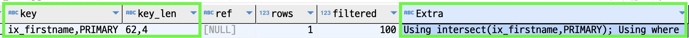
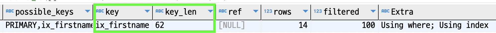

#### 인덱스 머지
쿼리플랜에서 한 테이블을 조회할때에 여러개의 인덱스를 사용할 수 있을까?  
필요에 따라 그럴 수 있다. 하나씩 알아보자.

##### 인덱스 머지 - 교집합 (index_merge_intersection)
`employees` 테이블에는 `emp_no (pk)`와 `first_name (ix_firstname)`으로 각각 인덱스가 있다.  
그리고 아래의 쿼리플랜을 예상해보자.  
인덱스를 여러개 사용할 수 없다해도 위에 설명한 두개의 인덱스 중 아무거나 사용해도 크게 지장은 없을 것이다.

~~~sql
explain
  select *
    from employees 
   where first_name = 'Georgi'
     and emp_no BETWEEN 10000 and 20000
;
~~~

실제 쿼리플랜은 아래와 같다.  

`Extra`를 보면 두 개의 인덱스를 모두 사용한 것을 알 수 있다.  
둘 중 하나의 인덱스를 사용하지 않고 둘 다 이용한 이유를 유추해보자.  
`first_name = 'Georgi'`조건에 해당하는 데이터는 `253`개다.  
`emp_no BETWEEN 10000 and 20000`조건에 해당하는 데이터는 `10000`개다.  
두 조건 모두에 해당하는 데이터는 `14`개다.  

`first_name` 인덱스를 사용했다면 `254 - 14`번의 불필요한 필터링 작업이 있었을 것이고,  
`pk`를 사용했다면 `10000 - 14` 번의 불필요한 필터링 작업이 있었을 것이다.  
두 인덱스를 모두 사용했다면 필터링 작업 없이 두 결과값의 `교집합(emp_no)`을 추출하는 로직이 수행되었을 것이다.  
옵티마이저는 교집합 추출이 더 효율적이라고 판단한 것이다. 

만약 교집합 옵션을 제거하면 어떻게 수행될지 예상해보자.  
우리는 [인덱스 확장](B_Index-Extention.md)을 공부하였다.  
이를 활용하여 생각해보면 `first_name, emp_no`의 인덱스가 있는 것처럼 인덱스 확장을 사용할 것으로 예상해볼 수 있다.  

옵션을 끄고 수행해보자.  

~~~sql
explain 
  select /*+ SET_VAR(optimizer_switch='index_merge_intersection=off')  */  count(*)
    from employees 
   where first_name = 'Georgi'
     and emp_no BETWEEN 10000 and 20000
;
~~~

예상대로 `ix_firstname` 인덱스를 사용하였고,   
`key_len`을 보니 인덱스 확장 (`ix_firstname (58 byte) + pk (4 byte)`)도 잘 수행된 것을 확인할 수 있다.  

##### 인덱스 머지 - 합집합 (index_merge_union)
쿼리부터 살펴보자.

~~~sql
explain
  select *
    from employees 
   where first_name = 'Matt' -- ix_firstname
      or hire_date = '1987-03-31' -- ix_hiredate
;
~~~
`first_name`과 `hire_date`는 각각의 컬럼으로 인덱스가 존재한다.  
`OR` 조건일 경우에는 하나의 인덱스만 사용할 수 없다.  
이런 경우에 mysql에서는 `인덱스 머지 - 합집합` 최적화를 사용한다.  
여기서도 두 개의 인덱스를 모두 사용한다.

최적화 순서는 아래와 같다.  

먼저 `first_name` 조건만으로 결과값을 조회한다.  
그리고 `hire_date` 조건만으로 결과값을 조회한다.  
그리고 두 결과값을 중복값을 제거하여 합친다.  

중복값을 제거하여 어떻게 합칠 수 있을까?  

이유는 역시 `세컨더리 인덱스`가 `pk` 값을 참조하고 있는 것에 있다.  
`ix_firstname` 인덱스를 사용하여 `first_name` 조건으로 조회한다면 `first_name, emp_no(pk)`으로 순서가 이미 정렬되어 있다.  
`ix_hiredate` 인덱스를 사용하여 `hire_date` 조건으로 조회한다면 `hire_date, emp_no(pk)`으로 순서가 이미 정렬되어 있다.  
따라서, 별도의 정렬작업 없이 `우선순위 큐 알고리즘`을 사용하여 중복제거를 수행한다.   

`합집합` 최적화가 수행되었을 때에 쿼리플랜은 아래와 같이 `Extra`에서 확인할 수 있다.  

##### 인덱스 머지 - 정렬 후 합집합 (index_merge_sort_union)
쿼리부터 살펴보자.

~~~sql
explain
  select *
    from employees 
   where first_name = 'Matt'
      or hire_date BETWEEN '1987-03-01' and '1987-03-31'
;
~~~
`hire_date`의 조건이 바뀌었다.  
여기서 `ix_hiredate` 인덱스를 사용하여 조회를 해도 `emp_no`가 정렬되어있지 않다.  
따라서 `ix_hiredate` 조건으로 검색을 하고 `emp_no`로 정렬을 한 뒤에 위의 `합집합 최적화`를 해야한다.  
이런 경우에 쿼리플랜은 아래와 같이 출력된다.

