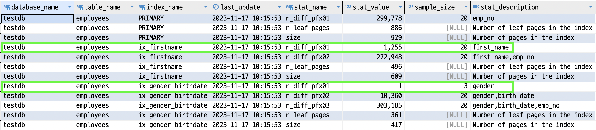
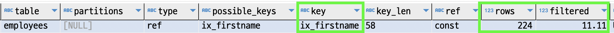
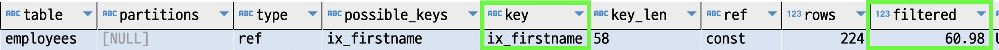
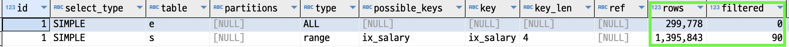

#### 테이블 통계정보
테이블의 통계정보는 중요하다.  
실제 데이터가 어떻게 분포되어 있는지, 각 인덱스는 어떤 특징을 가지고 있는지는 더 나은 실행계획을 세울때에 도움이 된다.

~~~sql
select * from employees where gender = 'M' and first_name = 'Matt'; 
~~~

예를 들어,  
위의 쿼리는 `ix_gender_birthdate`, `ix_firstname` 두 개의 인덱스를 모두 사용할 수 있다.  
그런데 `ix_gender_birthdate`에서 `gender`만 사용하면 인덱스의 거의 절반을 스캔해야하고,  
`ix_firstname`의 경우는 일부만 스캔해야 할 것이다.  
이러한 정보는 테이블 통계정보를 사용하여 확인할 수 있으며 더 나은 실행계획을 수립하는데에 사용할 수 있다.  

인덱스 통계 테이블을 직접 확인해보자. 

~~~sql
use mysql;
select *
  from innodb_index_stats
 where table_name = 'employees'
;
~~~

첫번째 초록박스는 `ix_firstname` 인덱스를 나타내고 그 중 `first_name` 컬럼만을 분석한 정보이다.  
`stat_value` 컬럼을 보면 유니크한 값을 `1255`개로 찾은 것을 볼 수 있다.  
이는 `sample_size`의 `20`개의 innoDB 페이지개수를 샘플링하여 얻어낸 정보이다.  

두번째 초록박스는 `ix_gender_birthdate` 인덱스를 나타내고 그중 `gender` 컬럼만을 분석한 정보이다.  
마찬가지로 `stat_value` 컬럼을 보면 유니크한 값을 `1`개로 찾은 것을 볼 수 있다.  
실제 성별은 `2`개여서 `2`가 맞지만 샘플링한 `20`개의 페이지에서는 하나의 정보만 들어있던 것이다.  

여튼, 위의 쿼리중 두개의 인덱스중 하나를 선택해야 한다면 `stat_value`가 더 많은 `ix_firstname`를 선택하는게 좋아보인다.  
이런식으로 인덱스 통계정보는 더 나은 실행계획을 수립할때에 중요하다.

넘어가기 전 `stat_name` 컬럼의 `n_leaf_pages`는 인덱스의 `리프노드 페이지 개수`이고, `size`는 `인덱스 전체 페이지 개수`이다.

#### 히스토그램
mysql은 인덱스의 통계정보관리를 넘어 `히스토그램`이라는 것도 관리할 수 있다.  
`히스토그램`은 테이블의 컬럼단위로 통계정보를 관리하는 데이터이다.  
현재는 자동이 아니며 수동으로 수집해야 한다. 명령어는 아래와 같다.

~~~sql 
ANALYZE TABLE ... UPDATE HISTOGRAM ON ...
~~~
일단 수행하여 `히스토그램`에는 어떤 정보들이 들어있는 지 확인해보자.  

~~~sql
analyze table employees update histogram on gender, hire_date;

use information_schema;
    
select *
  from column_statistics
;
~~~
결과값의 `histogram` 컬럼은 json 형식이며 아래와 같이 출력되었다.

~~~json
## gender 컬럼
{
    "buckets": [
        [
            1,
            0.5978844027951035
        ],
        [
            2,
            1
        ]
    ],
    "data-type": "enum",
    "null-values": 0,
    "collation-id": 45,
    "last-updated": "2023-11-17 01:44:24.954174",
    "sampling-rate": 0.34747935694636256,
    "histogram-type": "singleton",
    "number-of-buckets-specified": 100
}

## hire_date 컬럼
{
    "buckets": [
        [
            "1985-02-01",
            "1985-03-01",
            0.009989756696179552,
            29
        ],
        [
            "1985-03-02",
            "1985-03-28",
            0.01990852019756392,
            27
        ],
        
        ...
        
        [
            "1997-12-08",
            "1998-07-29",
            0.9899798176489082,
            231
        ],
        [
            "1998-07-30",
            "2000-01-28",
            1,
            419
        ]
    ],
    "data-type": "date",
    "null-values": 0,
    "collation-id": 8,
    "last-updated": "2023-11-17 01:44:24.955128",
    "sampling-rate": 0.34747935694636256,
    "histogram-type": "equi-height",
    "number-of-buckets-specified": 100
}
~~~

먼저 `histogram-type` 부분을 보면 `sigleton`은 데이터의 값 단위로 `buckets`에 데이터를 저장한다.  
`equi-height`는 각 버킷의 `시작과 마지막 값`, `발생빈도` 그리고 `유니크한 값의 개수` 총 `4`개의 데이터를 저장한다.
`sampling-rate` 는 이 히스토그램 데이터를 만들기위해 전체 데이터 중 스캔한 비율이다.   
`number-of-buckets-specified`는 말 그대로 버킷의 개수인데 디폴트는 `100`이고 `100`이면 충분한 것으로 알려져있다.

이렇게 설정한 `히스토그램`은 쿼리 실행계획에서 이용할지의 세팅은 `condition_fanout_filter`라는 변수로 한다.  
그러면 이 `히스토그램`이 구체적으로 쿼리 실행계획에서 어떻게 이용되는지 살펴보자.

~~~sql
 explain
  select * 
    from employees 
   where first_name = 'Zita' 
     and birth_date BETWEEN '1950-01-01' and '1960-01-01'
;
~~~

실행계획을 분석해보면 `ix_firstname` 인덱스가 사용되었고,
`first_name = 'Zita'` 조건으로 `224`개의 데이터가 있을 것으로 예상했으며,  
이 중 `birth_date` 조건으로 `11.11 %`의 데이터만 유용할 것이라고 판단하였다.

`first_name = 'Zita'` 조건으로 `224`개의 데이터가 있는것은 맞으나,  
최종 데이터 개수는 `143`개로 무려 `63 %`가 유용한 데이터이다.  

`히스토그램`을 생성하고 다시 위의 실행계획을 분석하면 아래와 같이 `filtered`의 비율이 꽤나 정확해진 것을 볼 수 있다.

이러한 비율이 실행계획에 어떤 영향을 미칠 수 있다는 것일까?  
근접한 `filtered` 비율을 유추할 수 있다면 더 정확한 실행계획을 세울 수 있다.  
특히나 조인순서에 영향을 미칠 수 있다.  

~~~sql
explain
select * 
  from salaries s 
       inner join employees e 
      	  on e.emp_no and s.emp_no  
      	 and e.birth_date BETWEEN '1950-01-01' and '1950-02-01' 
 where s.salary BETWEEN 40000 and 70000
;
~~~

위의 실행계획은 `employees` 테이블을 풀스캔하여 `299,778`번의 조인이 일어났을 것이다.  
`salaries` 테이블의 `filter` 비율이 `90`이고 이를 드라이빙 테이블로 했다면 `1,395,843 * 0.9` 만큼 조인해야 하기때문이다.  
그러나 히스토그램을 분석하고 실제 `filter` 비율이 `10`이었다면 약 `139,584`번만 조인하면 되기 때문에 드라이빙 테이블을 바꿨을 수 있다.

그렇다면 `히스토그램`이 있는 컬럼이면 무조건 사용할까?  

~~~sql
select *
  from employees
where first_name = 'Tonny'
  and birth_date between '2954-01-01' and '1955-01-01'
;
~~~
위 예시에서 `first_name`은 `인덱스`와 `히스토그램`이 둘 다 있다고 가정해보자.   
`mysql 8` 버전에서는 `인덱스`가 있고 `히스토그램`이 있다면 `히스토그램`을 굳이 사용하지 않는다.  
그대신 `인덱스`를 활용하여 실제로 데이터를 샘플링해서 조금 읽어본다. 이를 `인덱스 다이브`라고 한다.  
이 정보는 실제 데이터 조회이므로 더 정확하다고 판단하는 것이다.

`인덱스 다이브`는 실행비용이 있고 `히스토그램`은 이미 만들어진 데이터를 조회하므로, `히스토그램`이 비용은 적게 들 것이다.  
이후 버전에서는 `인덱스 다이브`보다 `히스토그램`을 사용하는 방향으로 나올지 기대할수도 있을 것이다.

