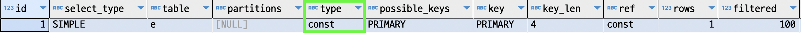

### 쿼리플랜
[쿼리플랜 읽는 법](B_Plan.md)에 익숙해졌다면 이제 쿼리플랜의 내용을 자세히 살펴보자.  
쿼리플랜을 보면 여러가지 정보(컬럼)가 있다.  
`id, select_type, table, type, possible_keys, key, key_len, ref, rows, filtered, Extra`등 정보가 많다.  
이 중 중요한 것들을 살펴보자.

### type
`type`은 쿼리플랜 중 `table`에 해당하는 테이블에 어떤 방식으로 접근했는지를 보여준다.  
`type`만 보고도 쿼리가 최적화되었는지 여부를 판단할 수 있는 중요한 정보이다.  
지금부터 설명하는 방식은 빠른 순서이다.  

##### const
`PK` 혹은 `유니크 키`로 접근하는 방식이다.  
`PK` 혹은 `유니크 키`로 접근했다는 의미는 반드시 `1`개의 데이터를 반환한다는 것이다.  
`유니크 키`나 다른 `인덱스`를 사용하더라도 `인덱스`의 일부만 사용하여 여러 건의 데이터를 반환한다면 `ref`로 표시된다.

~~~sql
explain
select *
  from employees e 
 where emp_no = 10001 -- pk
;
~~~

`const`는 이름 그대로 실제로 쿼리 최적화 단계에서 상수화하는 단계를 가진다.

~~~sql
explain
select *
  from employees e1 
 where e1.first_name = 
 	(select e2.first_name 
 	   from employees e2 
 	  where e2.emp_no = 100001
 	  );
~~~

위의 쿼리는 `e2`를 조회한 뒤에 `first_name`을 상수화 하여 `e1` 테이블을 조회한다.  
`e2`를 수행한 뒤에는 `e2`의 결과값을 상수화하여 아래의 쿼리를 수행한다.

~~~sql
select *
  from employees e1 
 where e1.first_name = 'Jasminko'
 ;
~~~

##### eq_ref
`eq_ref`는 조인되는 테이블에서만 나타난다. `eq_ref`가 쿼리플랜에 보인다면 조인대상 테이블이라고 생각해도 좋다.  
`eq_ref`는 위의 `const`와 같이 조인대상 테이블이지만 `pk` 혹은 `유니크키`로 조인되는 경우이다.  
다른 의미로 조인대상 테이블은 조인조건으로 무조건 `1`개의 데이터를 반환하는 것이다.

~~~sql
explain
select *
from dept_emp de, employees e
where e.emp_no = de.emp_no
  and de.dept_no = 'd005'
;
~~~

위의 쿼리는 `de` 테이블이 드라이빙테이블이 되었고 `e` 테이블을 조인하였다.  
`de` 테이블을 먼저 조회하고 `e` 테이블의 `pk`인 `emp_no` 조건으로 조인을 하니 `type`은 `eq_ref`이다. 

#### ref
`ref` 조건은 인덱스를 `동등조건(=)`으로 비교하되 인덱스의 왼쪽부터 일부만 사용하는 것이다.  
이 의미는 `조회의 결과가 여러개`일 수 있다는 것이다.  

~~~sql
explain
select *
  from dept_emp de 
 where dept_no = 'd005' -- pk (dept_no, emp_no)
 ;
~~~

위의 쿼리는 `pk`의 일부값만 조회조건으로 동등비교하여 사용하였고 당연히 결과값은 여러개가 나올 수 있다.  
이런 경우 `type`읃 `ref`이다.

#### const, eq_ref, ref
위의 세가지 `type`은 전부 `동등비교(=)`이어야 한다. (`<=>` 비교는 무시하자.)  
앞으로 설명할 `type`들은 `동등비교(=)` 조건을 충족하지 않아도 된다.

#### ref_or_null
`ref_or_null`는 `ref`에서 `null` 조건도 같이 비교하는 경우이다.  
`type`에 `ref_or_null`이 나오면 당황하지 말고 나쁘지 않은 조건으로 조회되었다고 생각해도 좋다.

~~~sql
explain
select *
  from titles t
where to_date ='1985-03-01' or to_date is null 
;
~~~

#### range
빈번하게 마주칠수 있는 `type`이다.  
인덱스를 동등조건이 아닌 `<, >, is null, between, in, like` 등의 연산자로 조회하는 경우이다.  
빈번하게 마주치는데 생각보다 뒤에 나와서 느리다고 생각할 필요는 없다.  
데이터 분포에 따라 다르겠지만 `range` 접근까지는 일반적으로 성능이 좋은 편이다.  

`range` 플랜의 간단한 쿼리하나를 적어둔다. 보고 넘어가자.

~~~sql
explain
select *
  from employees e  
where emp_no BETWEEN 10002 and 10004
;
~~~

### index
`index`도 업무를 하다보면 상당히 자주 마주치는 `type`이다.  
또한, 지금까지 잘못생각했던 `type`이기도 하다.   
`type`에 `index`가 있으면 인덱스를 잘 탔다고 오해했으니 말이다.   

`index`는 `index full scan`이다.  
사실상 `full table scan`과 크게 다르지도 않다.  
`full table scan`과 읽어야 할 데이터 수가 같기 때문이다.  
다만 `table`보다 적은 컬럼으로 구성된 테이블을 읽는 수준이다.  

예를 들어 `1억`건의 데이터를 처음부터 끝까지 읽어야 하는데, 
`full table scan`은 `50`개의 컬럼으로 구성된 테이블을 읽어야 하는 것이고,
`index`는 `2`개의 컬럼으로 구성된 테이블을 읽어야 하는 차이이다.  
전체적으로 읽어야 할 파일크기가 차이가 날 것이기 때문에 `full table scan`보다는 빠르긴 할 것이다.  

~~~sql
explain
select dept_name
  from departments d 
 order by dept_name desc limit 10
;
~~~

### key
`key` 컬럼은 실제 테이블 조회에 사용된 인덱스이다.  
일반적으로 조회는 하나의 인덱스를 사용하고 예외적으로 여러개의 인덱스를 사용할 수 있다.  ([참조](../b_optimization/C_Index-Merge.md))

### key_len
지금까지 무시했던 필드이기도 하다.  
여러 컬럼으로 구성된 인덱스를 사용하면 인덱스의 일부 컬럼만 이용할 수 있다.  
그렇다면 인덱스의 어느정도 일부만 사용되었는지 확인할수 있는 컬럼이 바로 `key_len` 필드이다.  

인덱스 컬럼이 `3`개로 구성되어있다면 `innodb`는 해당 인덱스의 `1`번 컬럼, `1~2`번 컬럼, `1~3`번 컬럼으로 구성된 인덱스의 통계를 보관한다.

~~~sql
use mysql;
    
select *
  from innodb_index_stats
 where table_name = 'employees'  
;
~~~

`ix_gender_birthdate` 인덱스는 `gender, birthdate` 두개의 컬럼으로 구성되어있다.  
`8`번째 `row`의 `stat_description`을 보면 `gender` 하나의 컬럼으로 통계정보를 보관하는 것을 알 수 있다.  
그리고 `stat_value`는 `gender` 하나의 컬럼만으로 통계정보를 보관할때에 유니크한 값이 `1`개라는 의미이다.  
성별은 `2`개인데 `1`개로 나오는 이유는 `sample_size`가 `3`으로 전체 데이터 중 `3`개 페이지만 샘플링했기 때문이다.

~~~sql
explain
select * 
  from employees e  
 where gender = 'M'
;
~~~

`key_len`은 `1`이다. `ix_gender_birthdate` 인덱스의 `1 byte`까지만 활용했다는 것이다.  

~~~sql
explain
select * 
  from employees e  
 where gender = 'M'
   and birth_date >= '1980-03-01'
;
~~~

위와 같이 조건을 추가하면 `key_len`이 `date`의 크기만큼 `3 byte`가 증가하는 것을 볼 수 있다.  
참고로 `key_len`은 `nullable`컬럼의 경우 `1 byte`를 추가로 사용한다.  

### rows, filteerd
`rows`는 데이터의 개수를 나타낸다.  
어떤 데이터의 개수일까?  
`rows`의 숫자는 반환하는 데이터의 값이 아닌 해당 테이블을 조회할 때 읽어야하는 총 데이터 수이다.  
이는 통계정보를 이용한 예측값으로서 정확하지는 않다.  
총 읽어야하는 데이터 수는 어떤 인덱스를 읽어야 할 지, 드라이빙 테이블은 어떤 테이블로 정해야 할지 등 쿼리플랜에서 중요한 역할을 한다.  
예를 들어, 특정 인덱스를 이용했을 때 읽어야 하는 `rows`가 적다면 이를 활용하는것이 성능상 이득일 것이다.  

`filtered`는 rows에서 실제 사용되는 레코드의 비율을 나타낸다.  
만약 `40`이 나온다면 `rows * 0.4`의 데이터가 실제 반환해야하는 데이터로 추측한 것이다.  
위에서 `rows`가 적을수록 이득이라고 했지만 사실 정확하게는 `rows * filtered`의 값이 적을수록 이득이라고 하는것이 정확하다.

### References
- https://dev.mysql.com/doc/refman/8.0/en/explain-output.html#explain-join-types