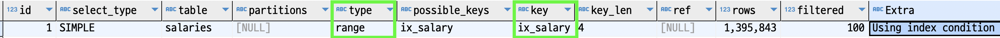
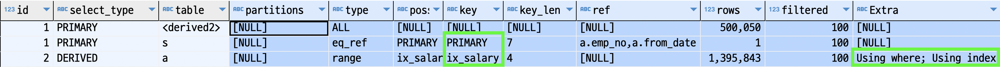

#### Using index
쿼리플랜의 `Extra` 정보에 `Using index`가 나오는 경우가 있다.  
일단 인덱스를 썼다는 것인데 단지 인덱스만 사용한것을 의미하지 않는다.  

`Using index`는 `커버링 인덱스`라고도 한다.  
인덱스에 포함된 정보만 가지고 요청을 처리했다는 의미이다.

인덱스에 포함된 정보만 가지고 요청을 처리했다는 것과 처리하지 못한것의 차이는 무엇일까?  

예시를 통해 알아보자.

~~~sql
select *
  from salaries 
 where salary BETWEEN 1 and 100000
 limit 500000, 50
 ;
~~~

위의 쿼리는 `ix_salary` 인덱스를 사용한다.  
`type=range`이지만 사실상 인덱스의 처음부터 끝까지 전부 읽어야 한다.  
그리고 `select *` 이기 때문에 모든 컬럼을 조회해야 한다.  

옵티마이저가 되었다고 가정하고 쿼리를 수행해보자.  
`ix_salary` 조건을 이용하여 인덱스의 처음부터 최소 `500000 + 50`건의 데이터를 읽어나간다.  
`select *` 이라서 모든 정보를 리턴해야 하므로, `ix_salary`에 연결된 `pk` 참조값을 이용하여 `500000 + 50`번의 디스크접근을 해야한다.  
쿼리는 실제로 `30`초가 소요된다.  

인덱스를 사용하여 한건씩 디스크 접근을 하는것보다 차라리 테이블 풀스캔이 더 빠르다.
아래 쿼리를 수행하여 `ix_salary` 인덱스를 비활성화하면 테이블 풀스캔을 타게 된다.

~~~sql
alter table salaries alter index ix_salary invisible;
~~~

`테이블 풀스캔`을 하면 `1`초내로 수행된다.  
`테이블 풀스캔`을 사용하지 않고 `커버링 인덱스`를 사용하여 위의 쿼리를 개선해보자.  

`커버링 인덱스`는 인덱스에 포함된 정보만으로 요청을 처리하는 것이라고 했다.  
`ix_salary`는 `salary` 컬럼 하나로 구성되어있다.  
`select salary from ~`와 같이 `select` 조건에 `salary` 하나만 걸어야 한다는 것이다.  

`salary` 테이블의 `pk`는` emp_no, from_date` 인것을 참고하여 아래와 같이 개선해보자.

~~~sql
select s.*
  from salaries s ,
       (
        select a.salary, a.emp_no, a.from_date
          from salaries a
          where a.salary BETWEEN 1 and 100000
        limit 500000, 50
       ) a 
 where s.emp_no = a.emp_no
   and s.from_date = a.from_date
;
~~~

다시 옵티마이저가 되어 위의 쿼리를 수행해보자.  
`ix_salary` 인덱스를 이용하여 `500000 + 50`건의 데이터를 읽는다. 디스크 접근은 없다.`(커버링 인덱스)`       
`ix_salary`에는 `salary` 컬럼만 있는데 왜 디스크 접근이 없냐는 질문이 있을 수 있다.  
`mysql`은 `클러스터링 인덱스` 구조이고 이에 따라 `세컨더리 인덱스`가 `pk`를 참조하고 있으므로 ([참조](../a_basic/C_Index.md))  
위와 같은 `인덱스 포함 컬럼 + pk`의 조회는 디스크 조회가 필요없다. 
`pk`를 이용하여 읽은 `50`개의 데이터에 대한 디스크 접근만 하면 된다.  

위 수행은 역시 `1`초 내외로 완료된다.  
쿼리플랜은 아래와 같이 첨부한다.

~~~sql
-> Limit: 200 row(s)  (cost=414528.81 rows=50) (actual time=2847.096..2848.292 rows=50 loops=1)
  -> Nested loop inner join  (cost=414528.81 rows=50) (actual time=2847.089..2848.186 rows=50 loops=1)
      -> Table scan on a  (cost=0.06..3.12 rows=50) (actual time=0.006..0.061 rows=50 loops=1)
          -> Materialize  (cost=281037.43..281040.49 rows=50) (actual time=2847.038..2847.195 rows=50 loops=1)
              -> Limit/Offset: 50/500000 row(s)  (cost=281032.37 rows=50) (actual time=2846.531..2846.897 rows=50 loops=1)
                  -> Filter: (salaries.salary between 1 and 100000)  (cost=281032.37 rows=1395843) (actual time=0.037..2385.496 rows=500050 loops=1)
                      -> Covering index range scan on salaries using ix_salary over (1 <= salary <= 100000)  (cost=281032.37 rows=1395843) (actual time=0.031..1460.587 rows=500050 loops=1)
      -> Single-row index lookup on s using PRIMARY (emp_no=a.emp_no, from_date=a.from_date)  (cost=0.27 rows=1) (actual time=0.013..0.015 rows=1 loops=50)
~~~

