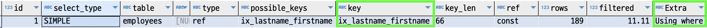
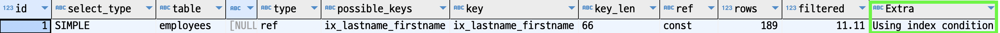

#### Using index condition
쿼리플랜의 `Extra` 컬럼의 `Using index condition`를 알아보자.  
이 정보는 `index condition pushdown`가 발생했을 때에 적히는 정보이다.  
`index condition pushdown`는 또 무엇인가?  

예제로 알아보자.  

`employees` 테이블에 `last_name, first_name`으로 구성된 인덱스 `ix_lastname_firstname`를 추가해보자.

~~~sql
alter table employees add index ix_lastname_firstname (last_name, first_name);
~~~

테스트를 위해 `index_condition_pushdown` 옵션은 꺼둔다.

~~~sql
set  session optimizer_switch='index_condition_pushdown=off';
~~~

그리고 아래의 쿼리는 어떻게 동작할지 생각해보자.

~~~sql
explain
select *
from employees
where last_name = 'Acton'
  and first_name like '%sal'
;
~~~

`ix_lastname_firstname` 인덱스를 이용할 것이고,  
`last_name` 컬럼은 `조회조건`이고 `first_name` 컬럼은 `필터링조건`이다.  
`first_name`은 `like '%sal'` 조건으로 걸려있기 때문이다.  
쿼리의 수행은 아래와 같을 것이다.

`ix_lastname_firstname` 인덱스에서 `last_name = 'Acton'` 조건으로 전부 검색한다.  
그리고 `스토리지 엔진`에서 이에 해당하는 모든 데이터를 하나씩 디스크 접근하여 레코드를 가져오고,  
`mysql` 엔진에서 `first_name like '%sal'`에 맞는지 필터링을 할 것이다.

쿼리플랜은 아래와 같다.

`Extra` 컬럼에 `Using where`를 보니 예상한대로 동작한 것 같다.

문득 의문이 든다.

`ix_lastname_firstname` 인덱스에 이미 `firstname` 컬럼이 있으므로,    
굳이 디스크에서 꺼내서 비교하지말고 디스크에 접근하기 전에 비교하면 디스크접근을 안할수 있고 좋은것이 아닌가?  

맞다. 그것을 가능하게 하는 최적화가 `index_condition_pushdown`이다.  
이 설정을 `off`로 설정하면 `mysql 엔진`은 `스토리지 엔진`으로 인덱스에 포함된 `last_name, first_name` 두 컬럼을 다 넘기지 않는다.    
`last_name`으로만 조건을 검증하고 참조하고 있는 `pk` 값만을 `스토리지 엔진`으로 넘긴다.  
그렇기 때문에 `스토리지 엔진`은 `pk`로 디스크 접근을 한 이후에야 `first_name`으로 필터링 할 수 있는 것이다.  

이제 설정을 켜보자.  

~~~sql
set  session optimizer_switch='index_condition_pushdown=on';
~~~

그리고 위의 쿼리플랜을 다시 조회해보자.  

  

`Extra` 부분이 `Using index condition`으로 변경되었다.  
이는 `index_condition_pushdown`이 정상적으로 동작했다는 의미이다.

#### References
- https://dev.mysql.com/doc/refman/8.0/en/index-condition-pushdown-optimization.htmlrstname