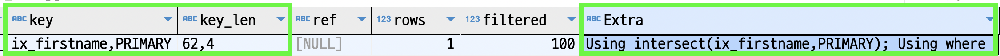
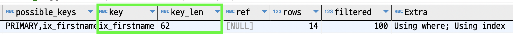

#### 인덱스 머지
쿼리플랜에서 한 테이블을 조회할때에 여러개의 인덱스를 사용할 수 있을까?  
필요에 따라 그럴 수 있다. 하나씩 알아보자.

##### 인덱스 머지 - 교집합 (index_merge_intersection)
`employees` 테이블에는 `emp_no (pk)`와 `first_name (ix_firstname)`으로 각각 인덱스가 있다.  
그리고 아래의 쿼리플랜을 예상해보자.  
인덱스를 여러개 사용할 수 없다해도 위에 설명한 두개의 인덱스 중 아무거나 사용해도 크게 지장은 없을 것이다.

~~~sql
explain
  select *
    from employees 
   where first_name = 'Georgi'
     and emp_no BETWEEN 10000 and 20000
;
~~~

실제 쿼리플랜은 아래와 같다.  

`Extra`를 보면 두 개의 인덱스를 모두 사용한 것을 알 수 있다.  
둘 중 하나의 인덱스를 사용하지 않고 둘 다 이용한 이유를 유추해보자.  
`first_name = 'Georgi'`조건에 해당하는 데이터는 `253`개다.  
`emp_no BETWEEN 10000 and 20000`조건에 해당하는 데이터는 `10000`개다.  
두 조건 모두에 해당하는 데이터는 `14`개다.  

`first_name` 인덱스를 사용했다면 `254 - 14`번의 불필요한 필터링 작업이 있었을 것이고,  
`pk`를 사용했다면 `10000 - 14` 번의 불필요한 필터링 작업이 있었을 것이다.  
두 인덱스를 모두 사용했다면 필터링 작업 없이 두 결과값의 `교집합(emp_no)`을 추출하는 로직이 수행되었을 것이다.  
옵티마이저는 교집합 추출이 더 효율적이라고 판단한 것이다. 

만약 교집합 옵션을 제거하면 어떻게 수행될지 예상해보자.  
우리는 [인덱스 확장](B_Index-Extention.md)을 공부하였다.  
이를 활용하여 생각해보면 `first_name, emp_no`의 인덱스가 있는 것처럼 인덱스 확장을 사용할 것으로 예상해볼 수 있다.  

옵션을 끄고 수행해보자.  

~~~sql
explain 
  select /*+ SET_VAR(optimizer_switch='index_merge_intersection=off')  */  count(*)
    from employees 
   where first_name = 'Georgi'
     and emp_no BETWEEN 10000 and 20000
;
~~~

예상대로 `ix_firstname` 인덱스를 사용하였고,   
`key_len`을 보니 인덱스 확장 (`ix_firstname (58 byte) + pk (4 byte)`)도 잘 수행된 것을 확인할 수 있다.  

